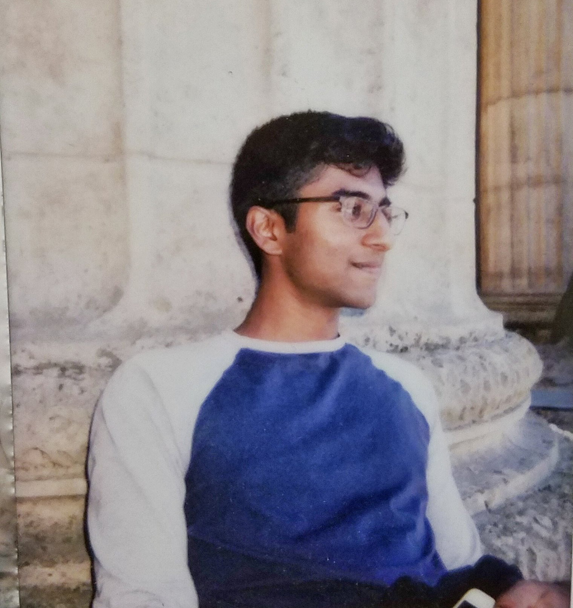

I'm a fourth year undergraduate studying EECS and math at UC Berkeley. In my research,
I work on robot learning with Professors Pieter Abbeel and Sergey Levine.

If you want to chat, shoot me an email at anair17berkeley.edu. Some of my projects are listed below.
